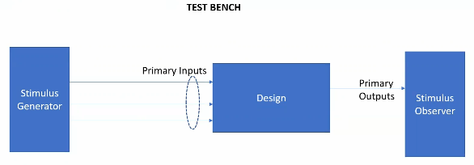
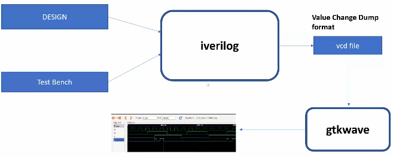
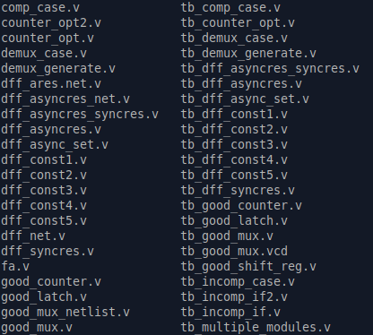

#  Day 1 - Introduction to Verilog RTL design and Synthesis
Topics:
- Introduction to open-source simulator iverilog
- Labs using iverilog and gtkwave
- Introduction to Yosys and Logic synthesis
- Labs using Yosys and Sky130 PDKs
## Introduction to open-source simulator iverilog
### Design vs Testbench
**Design** is the actual Verilog code or set of Verilog codes which has the intended funcionality to meet with the required specifications.

**Testbench** is the setup to apply stimulus(test_vectors) to the design to check its funcionality.

### Simulator
* RTL design is checked for adherence to the spec by simulating the design
* Simulator is the tool used for simulating the design. 
* This course will use **iverilator** as compiler tool.
#### How does Simulator Works
Simulator looks for the changes on the input signals. Upon change to the input, the output is evaluated. If no change to the input, no change to the output either.

#### Iverilog Based Simulation Flow

## Labs using iverilog and gtkwave
First, we need to clone the git repository to get all the files we will need to run the simulations.
Before that, make sure to install "git":
Linux OS:

`sudo apt install git`

Create a specific folder to your projects, let's name "VSLI":

`mkdir VSLI`

Now, change directory to the created folder and clone the repository:

`cd ./VSLI`

`git clone https://github.com/kunalg123/sky130RTLDesignAndSynthesisWorkshop.git`

Now, we can easily access the verilog/testbench verilog files in the following directory:

`./VSLI/sky130RTLDesignAndSynthesisWorkshop/verilog_files/`

#### Installing Iverilog and GTKWave
To install iverilog and gtkwave open the Linux terminal and type the command:

`sudo apt install iverilog`

 `sudo apt install gtkwave`

